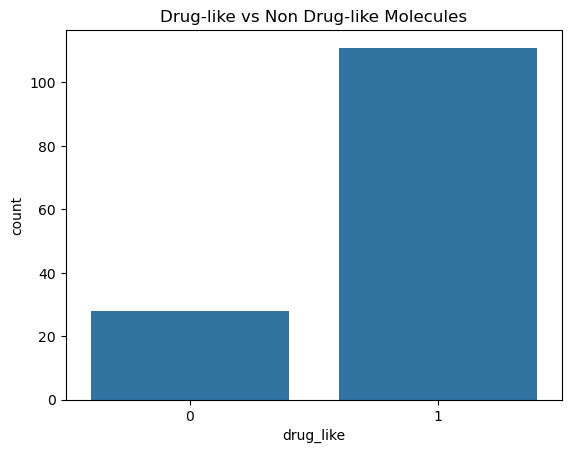
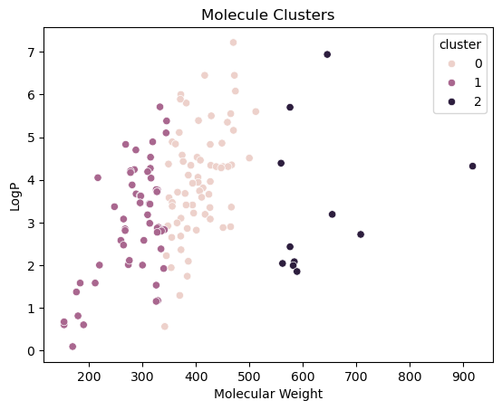
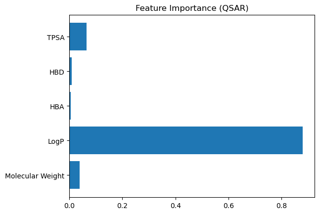

#  Cheminformatics Pipeline for Drug Discovery (EGFR Target)

##  Overview
This project implements an end-to-end cheminformatics pipeline for screening and ranking drug-like molecules targeting the EGFR protein using RDKit and machine learning.

---

##  Objectives
- Process molecular data from SMILES
- Identify drug-like compounds using Lipinski's Rule of Five
- Explore chemical space using clustering
- Build a QSAR model to predict molecular activity
- Perform similarity search using Tanimoto coefficient
- Rank potential drug candidates

---

##  Workflow

SMILES → RDKit → Descriptors → Lipinski Filter → Clustering → QSAR Model → Similarity Search → Ranking

---

##  Tools & Technologies
- Python
- RDKit
- Pandas, NumPy
- Scikit-learn
- Seaborn, Matplotlib

---

##  Results

### Drug-likeness Distribution

 Majority of compounds satisfy Lipinski's Rule, indicating strong drug-like properties.

---

### Chemical Space Clustering

 Molecules are grouped into distinct clusters, representing different chemical regions.

---

### Feature Importance (QSAR Model)

 LogP is the most influential feature affecting predicted molecular activity.

---

##  Top Predicted Molecules

| ChEMBL ID | Predicted Activity |
|----------|-------------------|
| CHEMBL1112 | 4.84 |
| CHEMBL1713 | 4.84 |
| CHEMBL8514 | 4.83 |
| CHEMBL71   | 4.83 |
| CHEMBL411  | 4.81 |

 These molecules are strong candidates for further drug screening.

---

##  Similarity Analysis

- Performed Tanimoto similarity using Morgan fingerprints
- Identified structurally similar compounds
- Enabled chemical space exploration and ligand screening

---

##  Skills Demonstrated

- Cheminformatics (RDKit)
- QSAR Modeling (Random Forest)
- Molecular Descriptor Analysis
- Chemical Space Clustering
- Tanimoto Similarity Search
- Drug-likeness Filtering (Lipinski Rule)

---

##  Notebook

[View Full Analysis](notebooks/analysis.ipynb)

---

##  Project Structure

data/
notebooks/
results/

---

##  Applications
- Drug discovery screening
- Ligand prioritization
- Chemical space analysis

---

##  Author
Mimansa Kulshrestha

##  Author
Mimansa Kulshrestha
